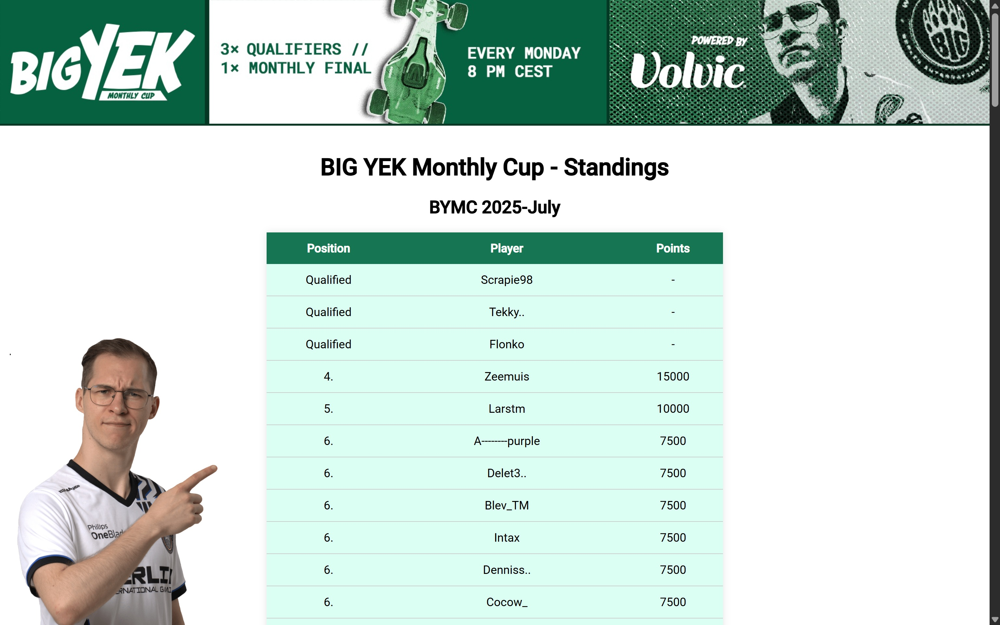
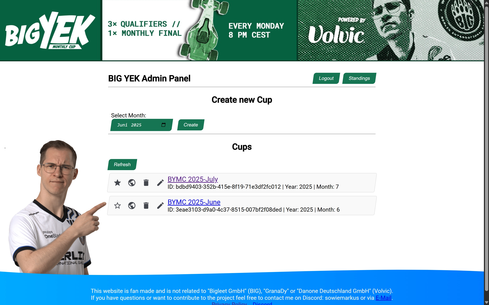
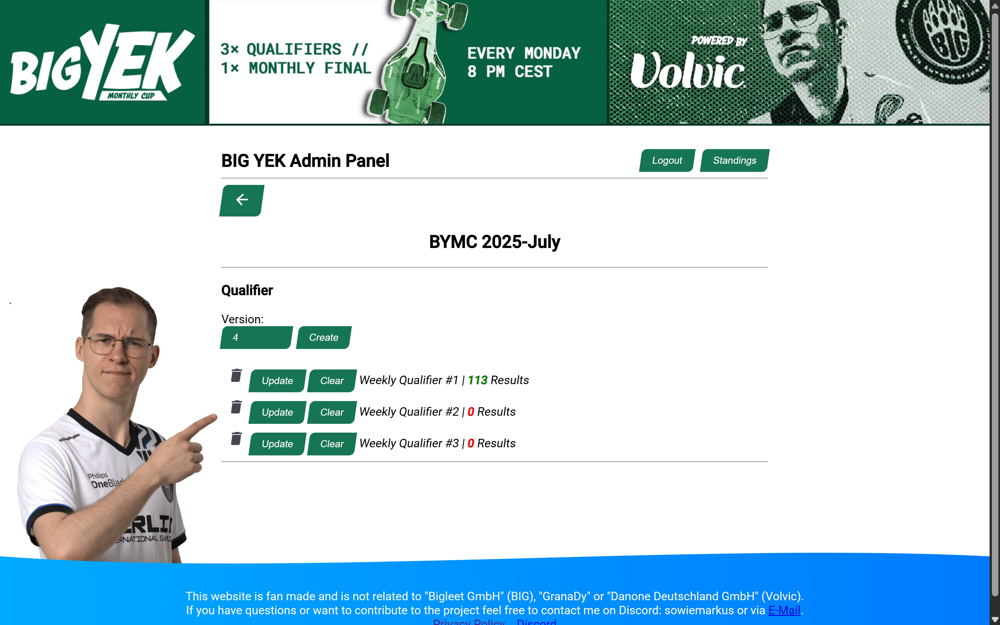

<p align="center">
  
</p>

# BYMC - BIG YEK Monthly Cup

> [!NOTE]
> The BYMC Monthly Cup has started partnering with [eCircuitMania](https://ecircuitmania.com/), and this project will no longer be maintained or updated.  
> Thank you to everyone who supported and contributed!

> [!NOTE]
> This website is fan made and is not related to "Bigleet GmbH" (BIG), "GranaDy", "logitech" or "Danone Deutschland GmbH" (Volvic).

Welcome to the Big YEK Monthly Cup management system! This backend application is designed to organize and manage the Big YEK Monthly Cup, a Trackmania 2020 tournament hosted by [GranaDy](https://twitch.tv/granadyy) and [Berlin International Gaming](https://bigclan.gg/) and sponsored by [logitech](https://www.logitech.com/de-de) and [Volvic](https://www.volvic.de/).

The tournament features weekly qualifiers leading up to an monthly final. With this project, you can create and manage multiple editions of the cup, store results, and calculate a leaderboard to determine which players qualify for the finals.

## Features

- **Edition Management**: Easily create and manage multiple editions of the tournament.
- **Results Storage**: Store and organize participant results from qualifiers and finals.
- **Leaderboard Calculation**: Automatically calculate and maintain leaderboards to identify top performers.

## Screenshots

<p align="center">
  
  
  
</p>

## Getting Started

1. Create a `packages/backend/.env` file based on the provided example.
2. Build the Docker image:

   ```sh
   docker build -t bymc-app .
   ```

3. Run the Docker container:

   ```sh
   docker run -p 3000:<port_from_env> bymc-app
   ```

   This will start the backend server on port 3000.  
   You can adjust the port mapping as needed.

## Technologies Used

This project leverages the following tools and frameworks:

- [Prisma](https://www.prisma.io/docs)
- [Express](https://expressjs.com/)
- [Angular](https://angular.dev/)
